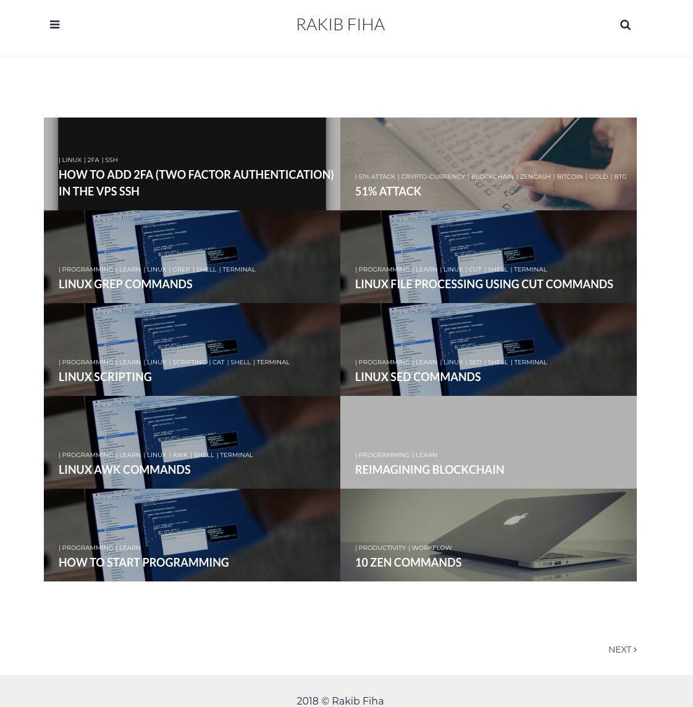
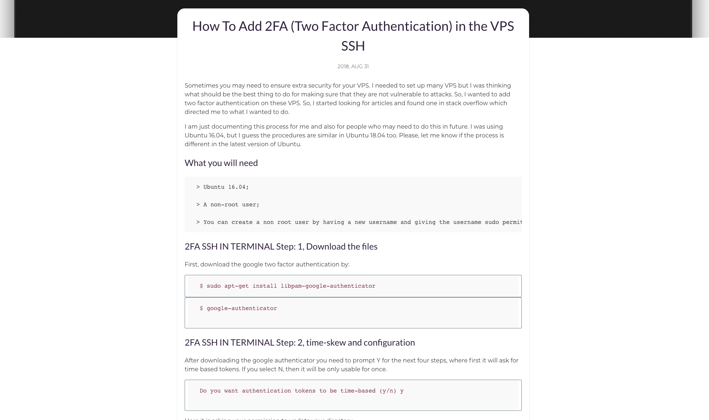

# Adam Blog is a minimal clear theme for Jekyll

## Demo

Check the theme in action [Demo](https://blogs.rakibfiha.com)

The main page would look like this:

The post page would look like this:

## Features

- [Google Fonts](https://fonts.google.com/)
- [Font Awesome](http://fontawesome.io/)
- [Disqus](https://disqus.com/)
- [MailChimp](https://mailchimp.com/)
- [Analytics](https://analytics.google.com/analytics/web/)
- [Search](https://github.com/christian-fei/Simple-Jekyll-Search)

## Installation:

Fork the ``master`` branch and delete ``gh-pages`` branch in it. This is important because ``gh-pages`` branch is used here only to host the blog. You should be using the master branch as the source and create a fresh ``gh-pages`` branch.

## License

GNU General Public License v3.0

## Donate

If you want to show your appreciation, buy me one  ! Every five cups of coffee and a new theme for Jekyll is ready 😋

Either way, your support is a way to thank me ❤️

<b>Thank you for your support!</b>

